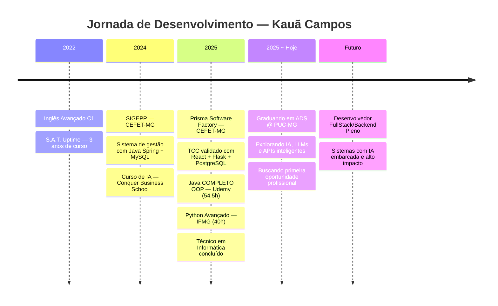

<div align="center">

```
██╗  ██╗ █████╗ ██╗   ██╗ █████╗     ██████╗ █████╗ ███╗   ███╗██████╗  ██████╗ ███████╗
██║ ██╔╝██╔══██╗██║   ██║██╔══██╗   ██╔════╝██╔══██╗████╗ ████║██╔══██╗██╔═══██╗██╔════╝
█████╔╝ ███████║██║   ██║███████║   ██║     ███████║██╔████╔██║██████╔╝██║   ██║███████╗
██╔═██╗ ██╔══██║██║   ██║██╔══██║   ██║     ██╔══██║██║╚██╔╝██║██╔═══╝ ██║   ██║╚════██║
██║  ██╗██║  ██║╚██████╔╝██║  ██║   ╚██████╗██║  ██║██║ ╚═╝ ██║██║     ╚██████╔╝███████║
╚═╝  ╚═╝╚═╝  ╚═╝ ╚═════╝ ╚═╝  ╚═╝    ╚═════╝╚═╝  ╚═╝╚═╝     ╚═╝╚═╝      ╚═════╝ ╚══════╝
```

</div>

<div align="center">
  
</div>

<br/>

<div align="center">
  <a href="https://www.linkedin.com/in/kauacampos/" target="_blank">
    
  </a>
  <a href="https://www.instagram.com/kauacamposz" target="_blank">
    
  </a>
  <a href="https://discord.com/users/kagebrazil" target="_blank">
    
  </a>
  <a href="mailto:kauauwc@gmail.com">
    
  </a>
</div>

---

## 👨‍💻 Sobre mim

```python
class KauaCampos:
    def __init__(self):
        self.nome        = "Kauã Magalhães Antunes Campos"
        self.objetivo    = "Desenvolvedor FullStack/Backend Júnior 🚀"
        self.formacao    = [
            "Técnico em Informática @ CEFET-MG (concluído: Dez/2025)",
            "Tecnólogo em ADS @ PUC-MG (previsão: Jul/2028)"
        ]
        self.idiomas     = { "Português": "Nativo", "Inglês": "Fluente (C1)" }
        self.estudando   = [
            "Inteligência Artificial & LLMs",
            "APIs de IA (OpenAI, Anthropic, Gemini)",
            "n8n & automações com IA",
            "Arquitetura de Sistemas Escaláveis",
            "Estruturas de Dados e Algoritmos"
        ]
        self.soft_skills = ["Trabalho em equipe", "Comunicação", "Adaptabilidade"]

    def hello_world(self):
        return "Seja bem-vindo ao meu perfil! Vamos construir algo incrível juntos 🤝"
```

---

## 🛠️ Stack Tecnológica

### 💬 Linguagens
<div align="left">
  
</div>

### ⚙️ Frameworks & Bibliotecas
<div align="left">
  
</div>

### 🗄️ Banco de Dados
<div align="left">
  
</div>

### 🔧 Ferramentas & DevOps
<div align="left">
  
</div>

### 🤖 Inteligência Artificial & Automação
<div align="left">
  
  
  
  
</div>

---

## 🚀 Projetos em Destaque

### 🏭 Prisma Software Factory — CEFET-MG `2025`
> Desenvolvimento de soluções de software para a ONG **INASIM**, atendendo demandas educacionais e administrativas. Validado como **TCC + Estágio Obrigatório**.

`TypeScript` `React + Vite` `Python (Flask)` `PostgreSQL`

---

### 📋 SIGEPP — Sistema Integrado de Gestão de Estágios e Pesquisas `2024`
> Sistema completo para gestão de estágios e projetos de pesquisa acadêmica no CEFET-MG. Backend robusto com interface responsiva integrada.

`Java Spring Boot` `PostgreSQL` `HTML/CSS/JS`

---

## 📊 GitHub em números

<div align="center">
  
</div>

---

## 📚 Atualmente estudando

```
🤖 Inteligência Artificial aplicada ao desenvolvimento
🔌 APIs de IA — OpenAI, Anthropic (Claude), Google Gemini
⚙️  n8n — automações e workflows inteligentes
🧩 Estruturas de Dados e Algoritmos
🏗️  Arquitetura de Sistemas Escaláveis
⚛️  React + Vite (aprofundamento)
☕  APIs RESTful com Spring Boot
```

---

## 🌱 Trajetória



---

## 🎯 Certificações & Cursos

| 📜 Curso | 🏫 Instituição | ⏱️ Carga | 📅 Conclusão |
|---|---|---|---|
| Inglês Avançado (C1) | S.A.T. – Uptime | 3 anos | Dez/2022 |
| IA: Produtividade e Carreira | Conquer Business School | 10h | Jun/2024 |
| Java COMPLETO — POO + Projetos | Nelio Alves / Udemy | 54,5h | Jul/2025 |
| Python Avançado | IFMG | 40h | Out/2025 |

---


<div align="center">
  

  > *"Primeiro, resolva o problema. Depois, escreva o código."* — John Johnson
</div>
