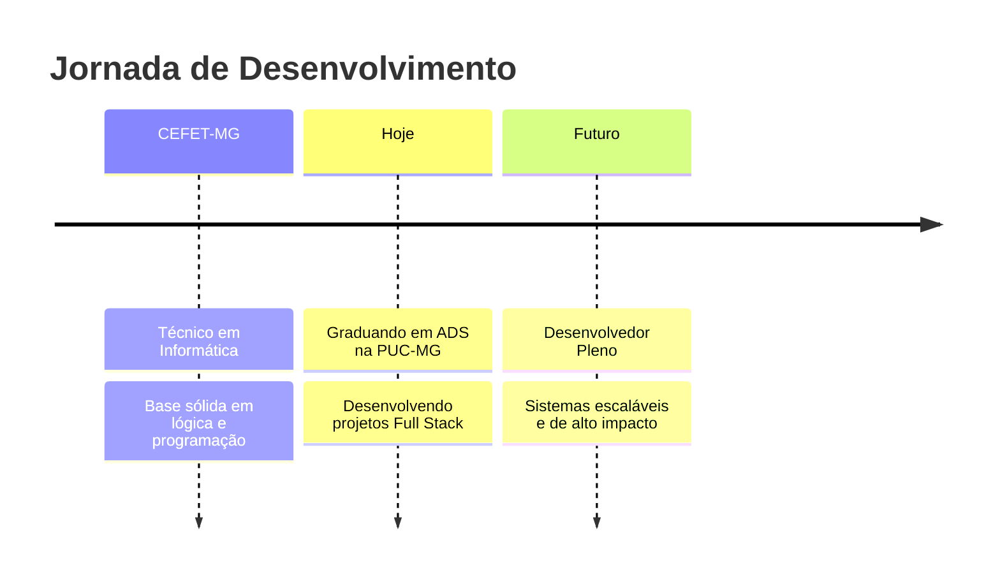

<div align="center">

```
██╗  ██╗ █████╗ ██╗   ██╗ █████╗     ██████╗ █████╗ ███╗   ███╗██████╗  ██████╗ ███████╗
██║ ██╔╝██╔══██╗██║   ██║██╔══██╗   ██╔════╝██╔══██╗████╗ ████║██╔══██╗██╔═══██╗██╔════╝
█████╔╝ ███████║██║   ██║███████║   ██║     ███████║██╔████╔██║██████╔╝██║   ██║███████╗
██╔═██╗ ██╔══██║██║   ██║██╔══██║   ██║     ██╔══██║██║╚██╔╝██║██╔═══╝ ██║   ██║╚════██║
██║  ██╗██║  ██║╚██████╔╝██║  ██║   ╚██████╗██║  ██║██║ ╚═╝ ██║██║     ╚██████╔╝███████║
╚═╝  ╚═╝╚═╝  ╚═╝ ╚═════╝ ╚═╝  ╚═╝    ╚═════╝╚═╝  ╚═╝╚═╝     ╚═╝╚═╝      ╚═════╝ ╚══════╝
```

</div>

<div align="center">
  
</div>

<br/>

<div align="center">
  <a href="https://www.linkedin.com/in/kauacampos/" target="_blank">
    
  </a>
  <a href="https://www.instagram.com/kauacamposz" target="_blank">
    
  </a>
  <a href="https://discord.com/users/kagebrazil" target="_blank">
    
  </a>
  <a href="mailto:kauauwc@gmail.com">
    
  </a>
</div>

---

## 👨‍💻 Sobre mim

```python
class KauaCampos:
    def __init__(self):
        self.nome       = "Kauã Campos"
        self.formacao   = ["Técnico em Informática @ CEFET-MG",
                           "Graduando em ADS @ PUC-MG"]
        self.foco       = ["Desenvolvimento Web", "Algoritmos", "Sistemas Escaláveis"]
        self.estudando  = ["Full Stack", "React + Vite", "Spring Boot", "DSA"]
        self.objetivo   = "Construir soluções que fazem a diferença 🚀"

    def hello_world(self):
        return "Seja bem-vindo ao meu perfil!"
```

---

## 🛠️ Stack Tecnológica

### 💬 Linguagens
<div align="left">
  
</div>

### ⚙️ Frameworks & Bibliotecas
<div align="left">
  
</div>

### 🗄️ Banco de Dados
<div align="left">
  
</div>

### 🔧 Ferramentas & DevOps
<div align="left">
  
</div>

---

## 📊 GitHub em números

<div align="center">
  
  
</div>

<div align="center">
  
</div>

---

## 📚 Atualmente estudando

```
📌 Desenvolvimento Full Stack
📌 Estruturas de Dados e Algoritmos
📌 React + Vite
📌 APIs RESTful com Spring Boot
📌 Banco de Dados e Arquitetura de Sistemas
```

---

## 🌱 Trajetória



---

<div align="center">
  
</div>

<div align="center">
  
  
  > *"Primeiro, resolva o problema. Depois, escreva o código."* — John Johnson
</div>
